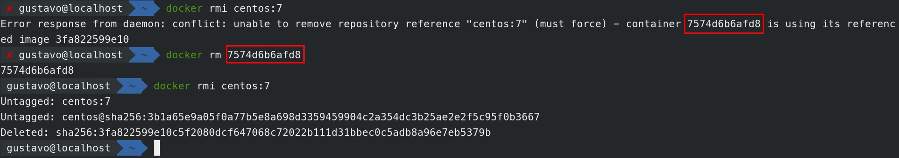

# 1.1 - Executar

## Lab 1.1 - Objetivos

* Buscar informações sobre o ambiente Docker
* Obter imagens de registros externos
* Manipular imagens do registro local
* Executar containers localmente

## Tarefas

### 1.1.1 - Informações do Ambiente local

Para buscarmos informações sobre o ambiente local, usa-se:

```text
docker info
```


### 1.1.2 - Buscando Imagens dos Registries

Toda instalação do runtime Docker acompanha configuração dos Registries mais comuns. Podemos ver isso por meio do comando `docker info`.

Por padrão, o registry `docker.io` já vem configurado como podemos ver na imagem acima.

Para buscar novas imagens nos Registries configurados, usa-se:

```text
docker search centos
```

Nesse caso, ele irá buscar as imagens do centos no Dockerhub \(docker.io\) que já vem pré-configurado com o Docker.


Você também pode filtrar pelo número de estrelas \(stars\) que um repo possui.

Para isso basta passar o parametro --filter

```text
docker search centos --filter=stars=10
```


No cenário acima, só existirão resultados que tenham mais que 10 estrelas.

### 1.1.3 - Baixando Imagens dos Registries

Além de nome, imagens possuem _tags_ \(sufixo separado por ':'\) que podem identificar versões ou variações de uma imagem específica. Para baixar uma imagem para o storage local de imagens, usa-se:

```text
docker pull centos:7
```


O comando acima é equivalente a:

```text
docker pull docker.io/centos:7
```

> INFO: Quando não especificamos qual registry queremos usar, o docker irá utilizar o que está configurado no arquivo /etc/sysconfig/docker. Quando instalado pela primeira vez, o padrão é o docker.io.

É possível também baixar imagens de outros registries quando especificamos isso na linha de comando:

No exemplo abaixo utilizaremos o registry oficial da Red Hat.

```text
docker pull registry.access.redhat.com/rhel-atomic
```

Caso você encontre o erro abaixo:


Ele acontece porque o registry da Red Hat exige certificado SSL. Para resolver isso, instale o seguinte pacote:

```text
yum install python-rhsm-certificates -y
```

Agora faça novamente o pull da imagem `rhel-atomic`:

```text
docker pull registry.access.redhat.com/rhel-atomic
```


No exemplo acima, ele buscará a imagem no registry `registry.access.redhat.com`

### 1.1.4 - Listando Imagens Locais

Para verificar quais imagens estão disponíveis localmente, usa-se:

```text
docker images
```


### 1.1.5 - Removendo Imagens Locais

Para remover as imagens, ou tags, do repositório local, usa-se:

```text
docker rmi <ID/tag>
```

Vamos remover a imagem do rhel atomic baixada no lab anterior:

```text
docker images | grep rhel-atomic
```


Agora que temos o ID da imagem, podemos apagá-la:


Caso a imagem já esteja sendo utilizada por um container. o Docker não irá executar essa ação e retornará um erro informando qual o id do container que está utilizando a imagem que desejamos apagar.


Para resolver, basta remover o container que está causando problemas para a gente.

```text
docker rm <id do container>
```



### 1.1.6 - Executando Containers

A execução de um container significa processar os metadados da imagem e criar um ou mais processos a partir dos dados armazenados. Para tal, usa-se:

```text
docker run -it centos:7 /bin/bash
```


No exemplo anterior você deve ter percebido que além de iniciar o container você entrou no isolamento. Para sair usa-se a sequência _CTRL+P+Q_. Para iniciar o container de forma _detached_, usa-se:

```text
# docker run -itd centos:7 /bin/bash
```

Caso queira entrar em um container já em execução, para fazer _attach_ no processo já em execução, usa-se:

```text
# docker attach <nome/ID>
```


