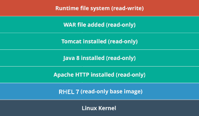

# 1 - Linux Containers

## Afinal, o que são containers?

A tecnologia de container Linux é, na verdade, um conjunto de capacidades que permitem o isolamento e contenção de aplicações. Apesar da recente exposição do termo, **essa tecnologia tem sua origem no UNIX V7, em 1979**,** **com a introdução do _chroot_. Depois disso, tivemos tecnologias como BSD Jails \(2000\), Solaris Zones \(2001\), Process Containers \(2006\) e LXC \(2008\).

Ao contrário da tecnologia de virtualização que encapsula um sistema operacional completo em cima de um hardware virtual para usar como casulo para aplicações, **containers usam de funcionalidades nativas do kernel Linux para garantir isolamento e contenção das aplicações**:

* **Namespaces:** _Permite criar uma abstração de um recurso de sistema global particular e fazê-lo aparecer como uma instância separada para processos dentro de um namespace. Esse isolamento permite que os processos usem componentes compartilhados sem influenciarem entre si._
* **Control Groups \(cgroups\):** _Permite agrupar processos para fins de gerenciamento de recursos do sistema, como uso de CPU e Memória principal. Dessa forma podemos implementar contenção do uso de recursos computacionais compartilhados do host._
* **SELinux:** _Fornece uma segurança adicional, implementando uma camada de controle de acesso mandatório \(MAC\) complementar às permissões POSIX. O objetivo é os processos dentro do container interfiram com outros processos em execução no host._

Apesar de ser uma tecnologia antiga, os containers ganharam popularidade principalmente pela sua **portabilidade ** e **simplicidade**. Soluções como [Docker](https://www.docker.com/) simplificaram a operacionalização de containers Linux \(das funcionalidades mencionada anteriormente\) e permitiram que este pudesse ser compartilhado através de imagens em formato padrão.

Além do Docker, existem também outras soluções de ferramental de containers no mercado:

* [RKT](https://coreos.com/rkt/) - CoreOS
* [LXD](https://www.ubuntu.com/containers/lxd) - Canonical

Com o surgimento de novas tecnologias de containers e com uma grande demanda por parte do mercado por esse tipo de ferramenta, foi criado uma especificação que norteia e direciona como os containers e imagens devem ser executados/criados. A [OCI](https://www.opencontainers.org/) \(Open Container Iniciative\) foi criada em 2015 e se propõe a criar uma padrão de mercado para runtime e images. Grandes empresas como Google, Red Hat, Intel e Amazon apoiam essa iniciativa.

## O que são imagens e como funcionam?

Os **containers são entidades efêmeras por natureza**, baseadas em imagens imutáveis. As imagens são a base de execução dos containers, e armazenam informações de **metadados \(parâmetros e \) **e os **dados \(executáveis, bibliotecas e arquivos\)** que serão usados na sua execução.

Como mecanismo de otimização, de espaço e de performance, essas imagens são construídas em **camadas sobrepostas, também imutáveis**. Dessa forma conseguimos aproveitar camadas comuns entre as diferentes imagens, **poupando espaço de armazenamento e melhorando a performance**.

A possibilidade de escrita na última camada deve ser utilizada com cautela, uma vez que essa camada é perdida na finalização do container \(efêmera\). Nesse ponto de vista, aplicações que dependem de persistências \(bancos de dados, cache, etc\) precisam de um mecanismo para guardar suas modificações nessa camada.

## Onde as imagens ficam armazenadas?

Existem dois tipos de repositórios, ou registros, importantes para armazenamento das imagens de containers: **registro local \(ou storage local\)** e **registros remotos \(públicos/privados\)**.

O **storage local é um espaço de armazenamento especial que reside no mesmo host que executa os containers**. Esse é usado para armazenas as imagens que serão usadas para executar containers nessa máquina, servindo como uma camada de cache. Esse é o primeiro repositório a ser consultado em busca de imagens.

Os **registros remotos são servidores, públicos ou privados, responsáveis por compartilhar imagens construidas por entidades e/ou usuários**. Estes registros podem permitir não só o acesso para download de imagens, mas também envio de imagens novas por usuários autenticados/autorizados. Dentre os mais famosos temos:

* [**https://hub.docker.com**](https://hub.docker.com)
* [**https://registry.access.redhat.com**](https://registry.access.redhat.com)
* [**https://registry.fedoraproject.org**](https://registry.fedoraproject.org)

Geralmente os registros remotos são executados na **porta 5000.**

