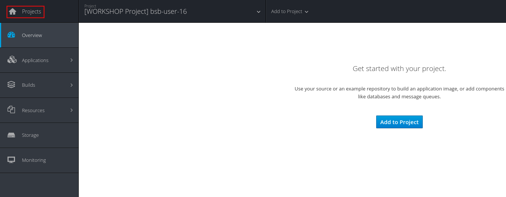

# 2.1 - Acesso

## 2.1.1 Acesso ao ambiente OpenShift Nuvem

Existe um ambiente provisionado no Google Cloud, utilizaremos este ambiente durante este workshop. Caso queira executar localmente pule para o passo 2.1.2.

1. Acesse a url: [https://console.paas.rhbrlab.com/console/](https://console.paas.rhbrlab.com/console/)
2. Faça o login através da opção **Red Hat Single Sign ON**


1. * informe as credenciais de acordo com o login designado pelo instrutor
   * altere sua senha no primeiro login 
2. No menu superior direito clique no ícone de ajuda e selecione a opção "**Command Line Tools**"
3. Copie o comando gerado "`oc login..`.". \(clique no botão no final do campo\) O seu token de acesso já estará nessa string.
4. Cole a linha de comando no seu terminal conforme exemplo abaixo

```text
oc login https://console.paas.rhbrlab.com --token=fkjaflowruwwoeuwourwori....................
```

**No fim do procedimento deverá aparecer a mensagem "Login success".**

Neste momento você já estará dentro do seu projeto.

A sua tela será semelhante a essa:


Esse nome destacado na imagem acima, é o `Display Name`do seu projeto. Na prática é um nome mais amigável.

Precisaremos usar o nome do seu projeto \(que não é o display name\) para várias operações nos labs posteriores. Para descobrir esse nome, basta ver um pequeno nome abaixo do display name conforme mostra a imagem abaixo:


O nome do seu projeto também pode ser visto pela linha de comando:

```text
oc get projects
```


Se você precisar ver os dados do seu projeto, basta clicar no menu de projetos conforme imagem abaixo:



## 2.1.2 Acesso ao ambiente Openshift Local

Este passo visa provisionar um Openshift single node no seu ambiente local. Este ambiente roda inteiramente em containers sendo um ambiente favorável para testes locais.

Como pré requisito, temos o Docker 1.13.

Faça o download do [oc client](https://developers.redhat.com/products/openshift/download/) através do [developers.redhat.com](https://developers.redhat.com/products/openshift/download/)

* Executem o comando abaixo:

```text
oc cluster up
```

### 2.1.2.1 Acessando a Web Console

Se os passos anteriores foram executados com sucesso, você verá as seguintes informações:


1. Esse é a url de acesso para a Web Console
2. Suas credenciais para acesso ao Openshift
3. Usuário com privilégio elevado para tarefas administrativas do cluster

