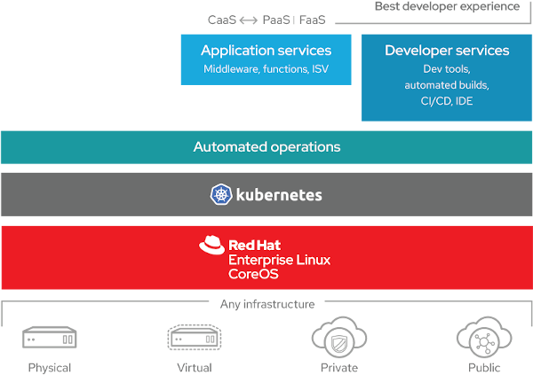

# Developer Experience (DevX) no OpenShift

**Uma das principais características do OpenShift é tornar a experiência do desenvolvedor mais agradável, simplificando as operações cotidianas em cima da plataforma de containers.** Algumas dessas simplificações são viabilizadas por extensões ao Kubernetes, e outras são automações de etapas (açúcar sintático).

Essa sessão foca em explicar as principais funcionalidades envolvidas no fluxo de trabalho para desenvolvimento de aplicações na plataforma. Vamos aprender que para fazer uso de uma plataforma de containers, desenvolvedores podem focar em escrever código de qualidade sem precisar se especializar detalhes de infraestrutura.

**Próximo:** [Build Automation](/developer-experience/build-automation)
