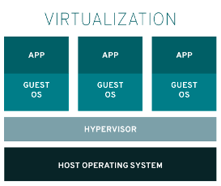
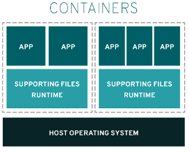

# Introdução

## Afinal, o que são containers

A tecnologia de container Linux é, na verdade, um conjunto de capacidades
que permitem o isolamento e contenção de aplicações. Apesar da recente
exposição do termo, essa é uma tecnologia que vem sendo aprimorada desde
o UNIX, com o chroot, ou do BSD, com o Jails.

  

Ao contrário da tecnologia de virtualização que encapsula um
sistema operacional completo em cima de um hardware virtual
para usar como casulo para aplicações, containers usam de
funcionalidades nativas do kernel Linux
para garantir isolamento e contenção das aplicações,
como por exemplo:

- Namespaces:

Permite criar uma abstração de um recurso de sistema
global particular e fazê-lo aparecer como uma instância separada
para processos dentro de um namespace. Conseqüentemente,
vários containers podem usar o mesmo recurso simultaneamente
sem criar um conflito.

- Control Groups (cgroups):

Permite agrupar processos para fins
de gerenciamento de recursos do sistema. Os Cgroups alocam o
tempo da CPU, a memória do sistema, a largura de banda da rede
ou combinações destes entre os grupos de tarefas definidos
pelo usuário.

- SELinux:

Fornece uma separação segura, pois impede que os
processos raiz dentro do container interfiram com outros processos globais.

- Linux Capabilities:

Permite a limitação dos privilégios
disponíveis a processos que rodam como root em pequenos grupos de privilégios.
Desse modo, um processo rodando com privilégios de root pode ser limitado
a obter apenas as permissões mínimas que ele precisa para executar suas tarefas.

***

Apesar das diversas funcionalidades, existem situações que podem
não funcionar conforme esperado quando executamos, por exemplo,
um container com Ubuntu em um servidor hospedeiro rodando CentOS.
Vale sempre lembrar que, container é linux e sua execução depende
das bibliotecas e principalmente do kernel do host.
Há muitos mecanismos de contêiner disponíveis para gerenciar e executar
contêineres individuais, incluindo *Rocket, Drawbridge, LXC, Docker e Podman.*

__Veja abaixo algumas vantagens importantes para o uso de contêineres:__

- Baixa área de ocupação do hardware:

Os contêineres usam recursos internos do SO para criar um ambiente isolado
em que os recursos são gerenciados usando recursos do SO. Essa abordagem
minimiza a quantidade de sobrecarga de CPU e na memória em comparação a
um hipervisor de máquina virtual.

- Isolamento de ambiente:

Os contêineres funcionam em um ambiente fechado onde as alterações feitas
no SO de host ou outros aplicativos não afetam o contêiner. Como as bibliotecas
necessárias para um contêiner são autocontidas, o aplicativo pode ser executado
sem interrupções.

- Implantação rápida:

Os contêineres são implantados rapidamente porque não há necessidade
de instalar todo o sistema operacional subjacente.

- Implantação em múltiplos ambientes:

Em um cenário tradicional de implantação usando um único host,
qualquer diferença de ambiente pode interromper o aplicativo.
Ao usar contêineres, no entanto, todas as dependências de aplicativo
e configurações de ambiente são encapsuladas na imagem do contêiner.

- Reusabilidade:

Ao usar contêineres, não há mais a necessidade de manter
servidores de bancos de dados de produção e desenvolvimento separados.
Uma única imagem de contêiner é usada para criar instâncias do serviço
de banco de dados.

***

Apesar de ser uma tecnologia antiga, os containers ganharam mais popularidade
hoje em dia principalmente pela sua portabilidade. Soluções como Docker
ficaram realmente atrativas quando permitiram que um container pudesse
ser compartilhado entre infraestruturas heterogêneas. Isso foi possível
graças a criação do
conceito de imagem, que será nosso próximo tópico nesse guia.

## O que são imagens e como funcionam

As  imagens são a base para a execução de contêineres. A imagem é um pacote de sistema de arquivos
que contém todas as dependências necessárias para executar um processo: **arquivos de  configuração, pacotes de sistema, bibliotecas, etc.**
Os contêineres em execução usam uma visualização imutável da
imagem, permitindo que vários contêineres utilizem a mesma imagem
simultaneamente.

Como mecanismo de otimização, de espaço e de performance, essas imagens são construídas em camadas sobrepostas, também imutáveis. Dessa forma conseguimos aproveitar camadas comuns entre as diferentes imagens, poupando espaço de armazenamento e melhorando a performance. Por exemplo:

Como as imagens são arquivos, elas podem ser gerenciadas
por sistemas de controle de versão, aprimorando a automação no contêiner
e o provisionamento de imagens.

## Onde as imagens ficam armazenadas

As imagens do contêiner precisam estar disponíveis localmente
para que o tempo de execução do contêiner as execute, elas
geralmente são armazenadas e mantidas em um repositório de imagens.
Existem dois tipos de repositórios, ou registros, importantes
para armazenamento das imagens de containers: registro local (ou storage local)
e registros remotos (públicos/privados).

O **storage local** é um espaço de armazenamento especial que reside
no mesmo host que executa os containers. Esse é usado para armazenar
as imagens que serão usadas para executar containers nessa máquina,
servindo como uma camada de cache. Esse é o primeiro repositório a
ser consultado em busca de imagens.

Os **registros remotos** são servidores, públicos ou privados,
responsáveis por compartilhar imagens construidas por
entidades e/ou usuários. Estes registros podem permitir não
só o acesso para download de imagens, mas também envio
de imagens novas por usuários autenticados/autorizados.
Dentre os mais famosos temos:

<https://quay.io>

<https://hub.docker.com>

<https://registry.access.redhat.com>

<https://registry.fedoraproject.org>
