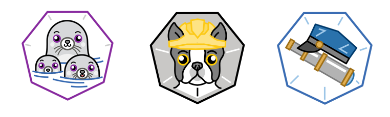

# Uso do podman, buildah e skopeo no RHEL 8

Contêineres, imagens e registros de imagens precisam interagir uns com
os outros. Por exemplo, você precisa ser capaz de criar imagens e colocá-las
em registros de imagens. Você também precisa ser capaz de recuperar uma
imagem do registro de imagens e criar um contêiner a partir dessa imagem.



O _**Podman**_ é uma ferramenta open source para gerenciar contêineres e
imagens de contêiner e interagir com registros de imagens. Ele oferece
os seguintes recursos principais:
Ele usa o formato de imagem especificado pelo Open Container Initiative ( OCI )
. Essas especificações definem um formato de imagem padrão, orientado
pela comunidade e não pelo proprietário.
O Podman armazena imagens locais em um sistema de arquivos local. Isso
evita arquitetura de servidor/cliente desnecessária ou ter daemons em execução
na máquina local.
O Podman segue os mesmos padrões de comando da CLI do Docker; portanto, não
é necessário aprender a usar um novo conjunto de ferramentas.
O Podman é compatível com o Kubernetes. O Kubernetes pode usar o Podman
para gerenciar seus contêineres.
Atualmente, o Podman está disponível apenas em sistemas Linux. Para instalar
o Podman no Red Hat Enterprise Linux 8, execute sudo yum install podman ou
sudo dnf install podman.

Suponha que queiramos rodar um container RHEL. Setaremos o nome desse container como 'meu-container'.
No terminal, execute:

```
$ podman run -itd --name meu-container rhel

4f0565cd5cbbdf1c7d973488aa2bf368b9fa120115a4d558d9105eb172015c4a
```

Podemos verificar informações de todos os containers ativos e rodando utilizando o comando 'ps':

```
$ podman ps

CONTAINER ID  IMAGE                                   COMMAND    CREATED        STATUS            PORTS  NAMES
ba0699504a1a  registry.access.redhat.com/rhel:latest  /bin/bash  2 seconds ago  Up 2 seconds ago         meu-container
```

_**Buildah**_
é uma ferramenta que facilita a criação das imagens de containers.
Uma das principais funcionalidades do buildah é permitir que você crie
uma imagem de container de um container existente, de um Dockerfile ou
mesmo do zero. O resultado será uma imagem compatível com as diretrizes da OCI.
Assim, elas estarão prontas para rodar em qualquer mecanismo de container que
também esteja de acordo com o padrão da OCI(como Podman e Docker).
O pacote ‘buildah’ está disponível no módulo ‘container-tools’  no RHEL 8.
Para instalar o buildah no Red Hat Enterprise Linux 8, execute sudo yum -y
install buildah.
Após a instalação, você pode consultar o manual (man pages) para mais
detalhes de como utilizar os comandos e outras funcionalidades inclusas no pacote.

O buildah é utilizado pelo Podman por debaixo dos panos. Ao utilizarmos:

```
$ podman images

REPOSITORY                        TAG      IMAGE ID       CREATED       SIZE
registry.access.redhat.com/rhel   latest   22bb38c596fc   4 weeks ago   215 MB
```

O que na verdade o podman faz, é utilizar o comando 'images' do buildah para verificar as images no registry local e disponibilizar na stdout.
Para comprovar, podemos executar:

```
$ buildah images
[...]
```

A saída dos 2 comandos deve ser a mesma, já que o podman utiliza das funções do buildah sobre gerenciamento de imagens, com adição de algumas outras funcionalidades como gerenciamento de containers.

_**Skopeo**_
é uma ferramente similar ao Buildah de certa forma, já que você também pode
manipular e criar imagens com ela. A grande diferença é que com Skopeo, essas
operações são feitas sem o Docker daemon. Dessa forma, ainda é possivel criar
e copiar imagens, inspecionar containers, e executar outras funcionalidades
sem utilizar os comandos do pacote docker. Os registries ou remote repositories
podem incluir o Docker Registry, registros locais, Red Hat Quay ou OpenShift
Registries.
Para instalar o skopeo no Red Hat Enterprise Linux 8, execute sudo yum -y
install skopeo.
Após a instalação, você pode consultar o manual (man pages) para mais
detalhes de como utilizar os comandos e outras funcionalidades inclusas no pacote.

Como exemplos, vamos exibir informações usando o comando 'inspect':

```
$ skopeo inspect registry.access.com/rhel:latest
[...]
```

Esses e outros comandos, bem como seus argumentos e flags, poderão ser explorados à seguir nos próximos capítulos do workshop onde aprofundaremos um pouco o conhecimento sobre containers e orquestração.
