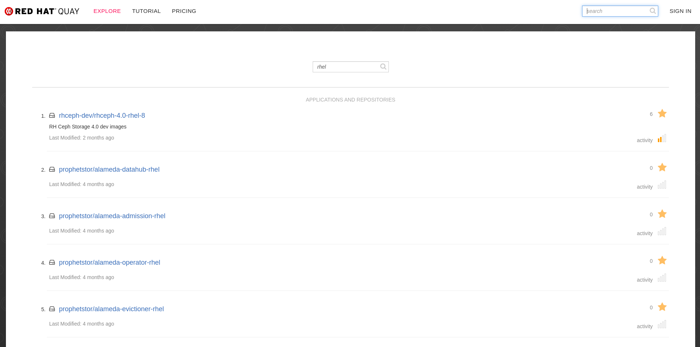
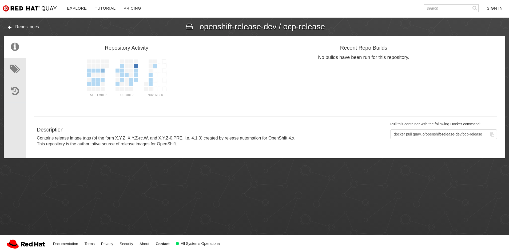
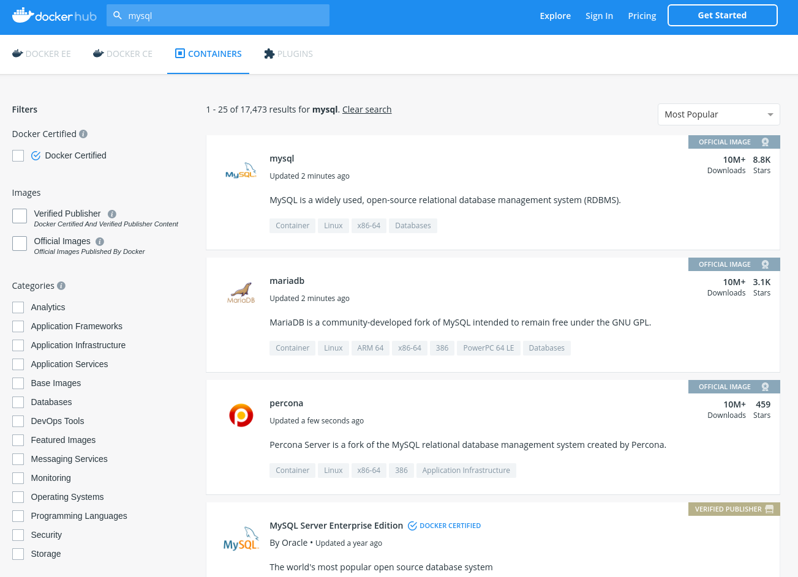
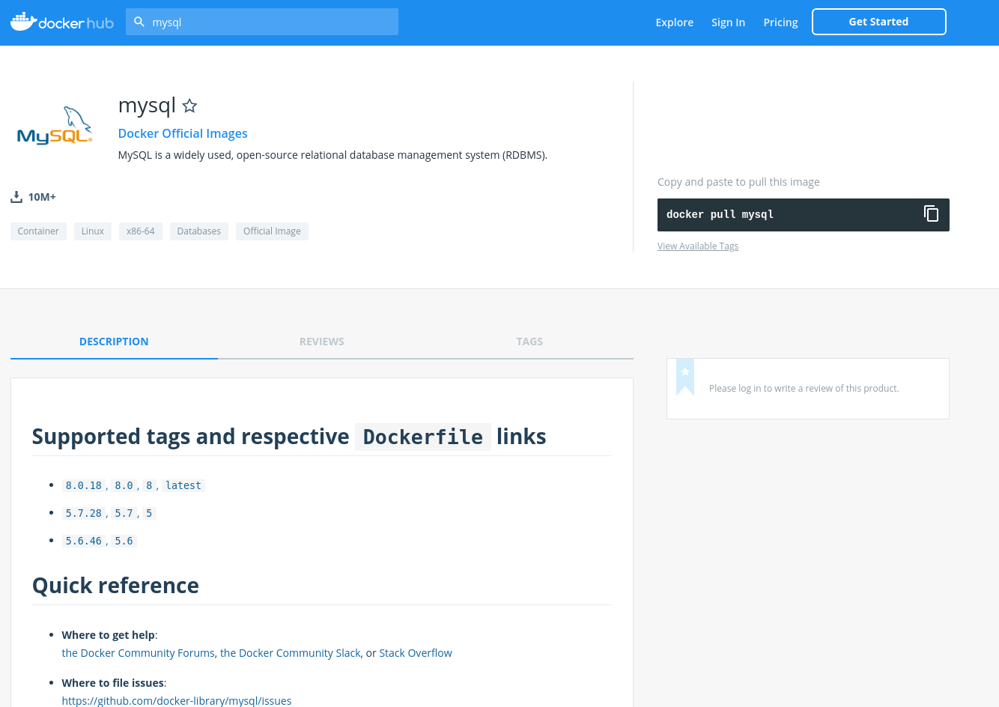

# Uso de registros remotos - Red Hat Quay e Docker Hub

Para compartilhar e reutilizar imagens, muitos aplicativos populares, idiomas e estruturas já estão disponíveis em registros de imagens públicas, como Quay.io.

**Quay.io** é um repositório de imagens públicas patrocinado pela Red Hat, ele introduz vários recursos interessantes, como criação de imagem no lado do servidor, controles de acesso refinados e verificação automática de imagens para vulnerabilidades conhecidas. Além disso,  o Quay.io oferece imagens dinâmicas regularmente atualizadas pelos criadores. Os usuários do Quay.io podem criar seus namespaces, com controle de acesso refinado e publicar as imagens criadas nesse namespace. Você pode pesquisar por imagens de contêiner usando
<https://quay.io/search>.

Clicar no nome de uma imagem fornece acesso à página de informações da imagem, incluindo o acesso a todas as tags existentes para a imagem e o comando para enviar a imagem.

***

Da mesma forma, exitem muitos repositórios de imagens diferentes disponíveis, como o **Docker Hub**. Qualquer pessoa pode criar uma conta do Docker Hub e publicar imagens de contêiner. Não há garantias gerais de qualidade e segurança. As imagens no Docker Hub variam entre aquelas com suporte profissional e experimentos amadores. Cada imagem pode ser avaliada individualmente. Depois de pesquisar uma imagem, a página de documentação pode fornecer um link para seu Dockerfile. Por exemplo, ao pesquisar por `MySQL` no DockerHub, temos:

O primeiro resultado ao pesquisar mysql é a página de documentação para a imagem MySQL official em <https://hub.docker.com/_/mysql>.

Nessa página, o link para a imagem 8.0/Dockerfile aponta para o projeto GitHub dockerlibrary, que hospeda Dockerfiles para imagens criadas pelo sistema de criação automática da comunidade do Docker.

**Próximo:** [Openshift básico](/openshift-basico/openshift)
