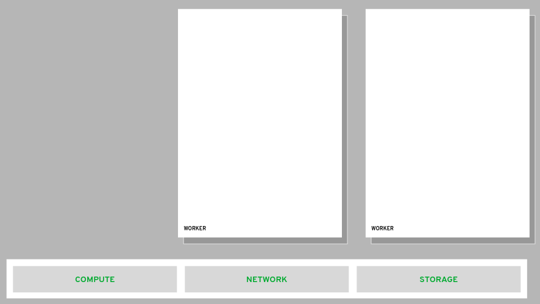
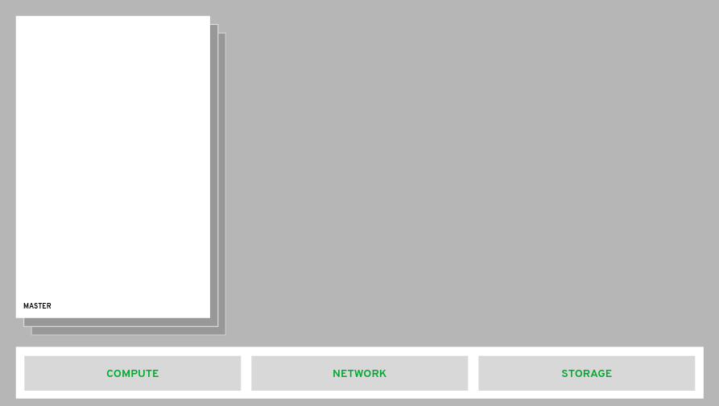
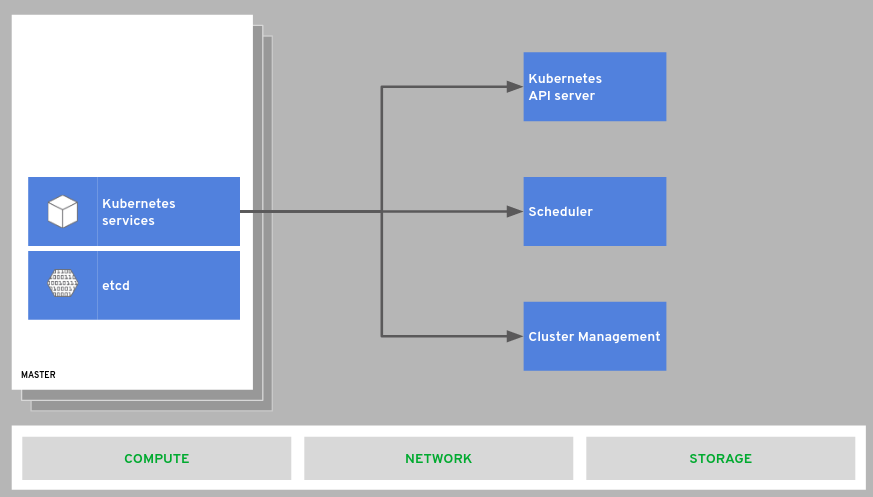
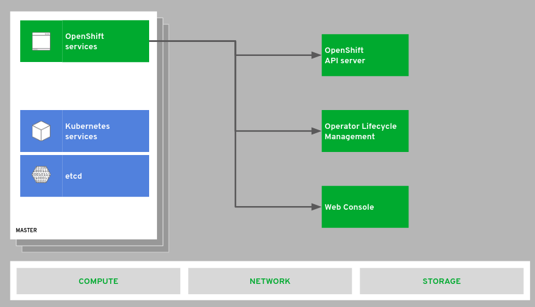
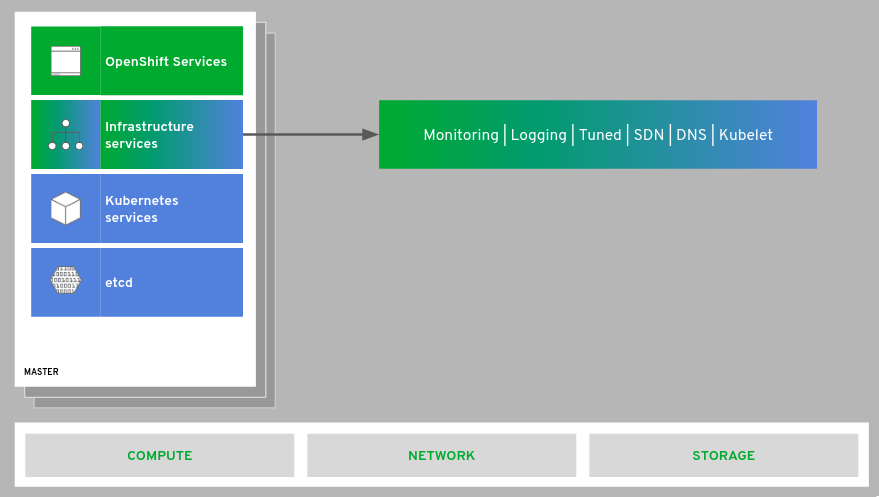
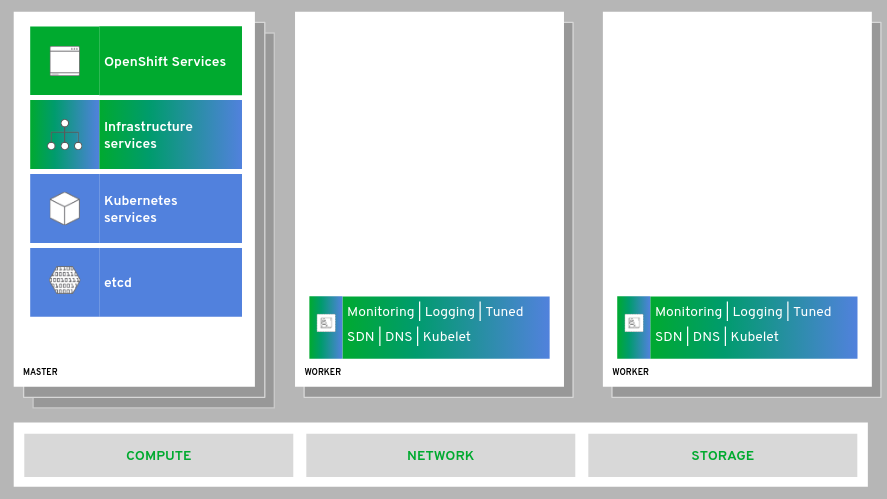
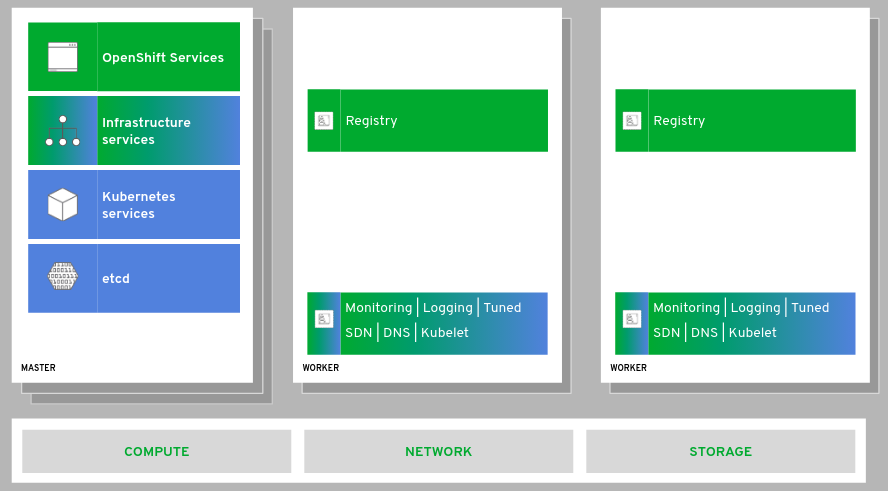
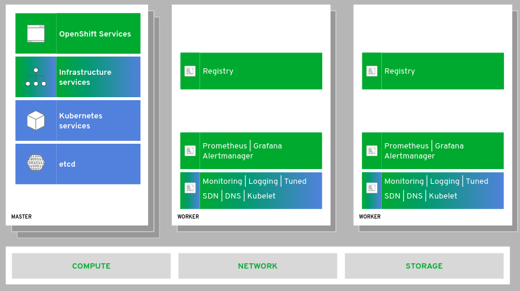
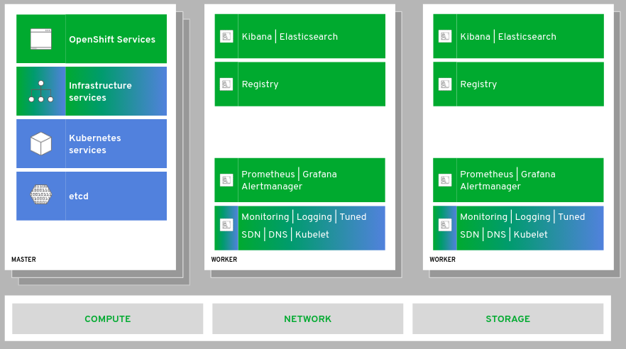
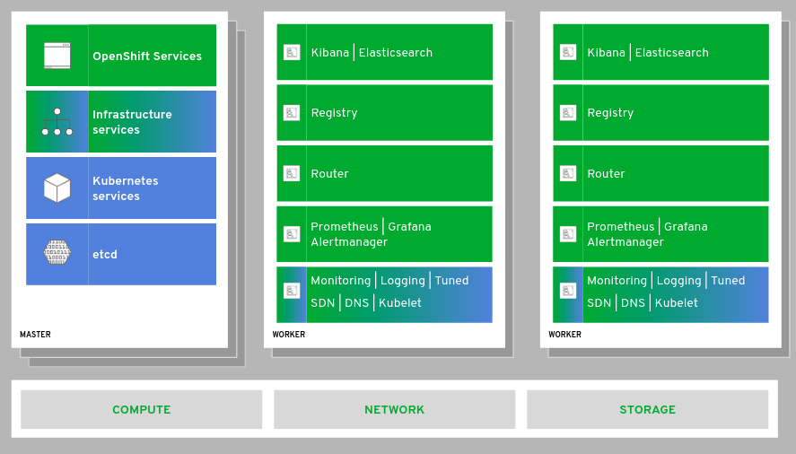

# Arquitetura e Componentes

O OpenShift é executado em uma variedade de plataformas de infraestrutura, do bare metal à nuvem privada e à nuvem pública.

Existem dois tipos de ***hosts*** em um ambiente OpenShift. **Worker nodes** são onde a carga de trabalho do usuário e vários componentes do OpenShift rodarão. Os worker nodes podem ser facilmente dimensionados e, em provedores de nuvem, até dimensionados automaticamente com base na capacidade do cluster.

O outro tipo de host é o **master**. O OpenShift usa 3 master nodes para alta disponibilidade e quorum de cluster. A carga de trabalho do usuário não é executada nos masters.

O **pod** é a unidade implementável e programável em um ambiente OpenShift. Embora um pod possa ter mais de um contêiner, todos os contêineres compartilham um único espaço de nome de rede e o pod recebe um único endereço IP na rede definida por software dentro do cluster.

O **etcd** é usado para acompanhar o estado de tudo no cluster, desde quais usuários estão logados até saber onde o workload da aplicação está, e muito mais.

O OpenShift foi desenvolvido no ***Kubernetes*** e seus componentes principais ainda estão lá e são acessíveis diretamente pelas APIs do Kubernetes.

O OpenShift traz seu próprio console da web com recursos especiais para administradores e desenvolvedores. O OpenShift disponibiliza seus recursos por meio de seus próprios endpoints de sua API. O OpenShift também oferece uma solução completa de gerenciamento do ciclo de vida, profundamente integrada, que permite atualizações sem interrupções e automáticas do cluster, feitas dentro do próprio cluster.

O OpenShift inclui vários serviços de infraestrutura interna e de suporte que facilitam o uso de containers em escala.

E, como esses serviços são executados em ***pods*** como parte da plataforma, eles podem ser orquestrados como qualquer outra carga de trabalho e executados em todos os ***hosts*** do ambiente.

O OpenShift inclui um registro de imagens de containers local. As imagens criadas dentro da plataforma usando os recursos nativos de criação do OpenShift aparecem automaticamente nesse registro de imagem. Sendo um registro totalmente compatível com OCI, as imagens criadas fora do ambiente também podem ser colocadas no registro integrado como parte de um processo maior do ciclo de vida do desenvolvimento de software.

O OpenShift inclui uma solução de monitoramento de cluster informada pelas melhores práticas dos engenheiros de confiabilidade do site da Red Hat. Essa pilha pré-configurada, baseada em **Prometheus, Grafana e Alertmanager**, ajuda os administradores de plataforma a entender a integridade e a capacidade do cluster OpenShift.

O OpenShift também inclui uma solução de agregação de logs baseada no **Fluentd, Elasticsearch e Kibana**. Essa solução integrada facilita a visualização e corrobora eventos de log para aplicativos dimensionados para várias instâncias e também está vinculada ao **RBAC** (controle de acesso baseado em função) do OpenShift, garantindo que apenas as pessoas certas vejam os logs que possuem permissão.

O OpenShift estende os recursos de entrada do Kubernetes com um roteador integrado que une o tráfego de fora do cluster para a rede definida por software (SDN). Essa solução de roteamento facilita a exposição da carga de trabalho e a acessibilidade dos consumidores que não estão dentro do cluster.

