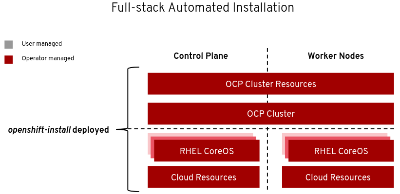
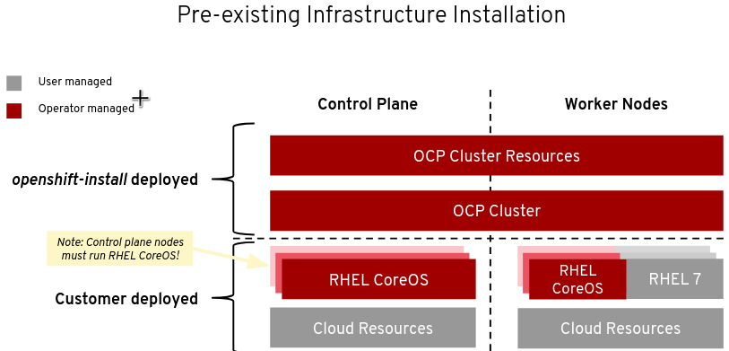
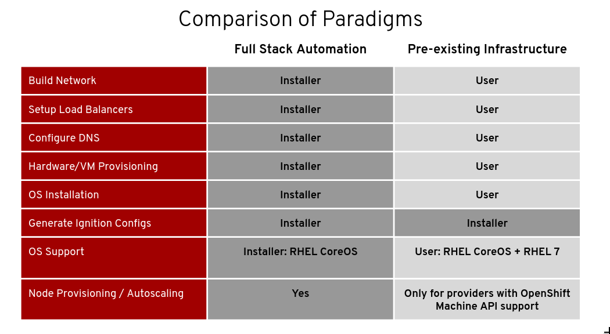

# Installer provisioned infrastructure (IPI)

**O instalador ou provedor da infraestrutura é capaz de provisionar a infraestrutura subjacente para o cluster. O instalador cria programaticamente todas as partes necessárias, incluindo redes (sub-redes, entradas DNS e balanceadores de carga), máquinas e sistemas operacionais. Isso é chamado de padrão IPI (Installer Provisioned Infrastructure)**. Pense nisso como uma arquitetura de referência de melhores práticas implementada no código. É recomendável que a maioria dos usuários use essa funcionalidade para evitar o provisionamento de sua própria infraestrutura. O instalador criará e destruirá os componentes de infraestrutura necessários para obter sucesso ao longo da vida útil do cluster.
Embora esse método de instalação seja altamente confiável e ofereça uma implementação das melhores práticas do OpenShift, ele não foi projetado para fornecer um alto grau de personalização da infraestrutura para ambientes que podem ter requisitos operacionais complexos.

# User Provisioned Infrastructure (UPI)

**O administrador deve criar sua própria infraestrutura, que inclui a criação de redes, a configuração do DNS, a configuração de balanceadores de carga, provisionamento de máquinas e a instalação de sistemas operacionais. Isso significa que o administrador, não o instalador, é responsável pela criação e exclusão desses objetos de infraestrutura**. Embora o administrador seja encarregado desse trabalho, ele permite mais personalização da infraestrutura com base nos requisitos operacionais.Após a criação da infraestrutura, o OpenShift 4 é instalado, mantendo sua capacidade de oferecer suporte a operações automatizadas e atualizações da plataforma

## Comparação

**Próximo:** [CodeReady Container](/openshift-basico/crc)
