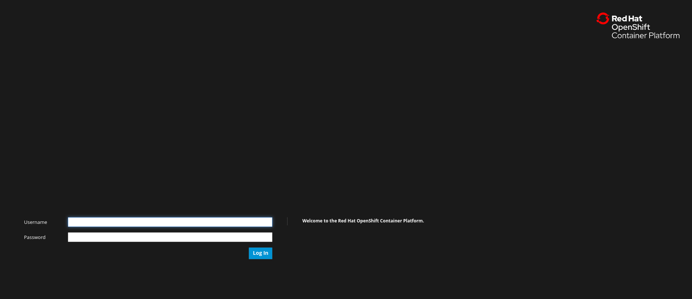
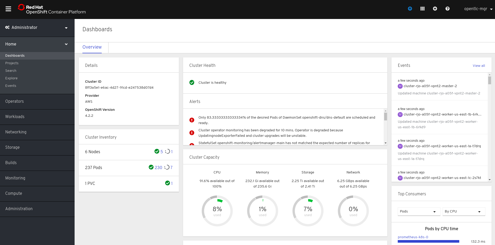
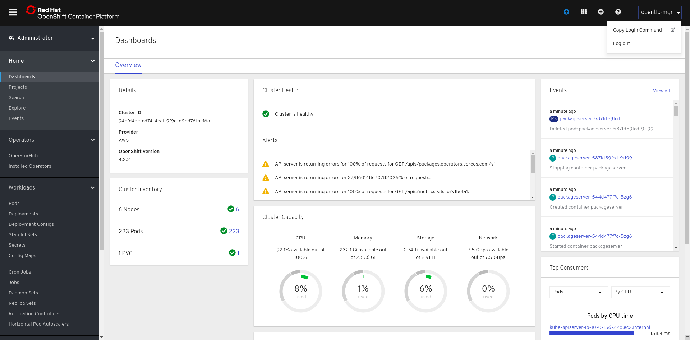
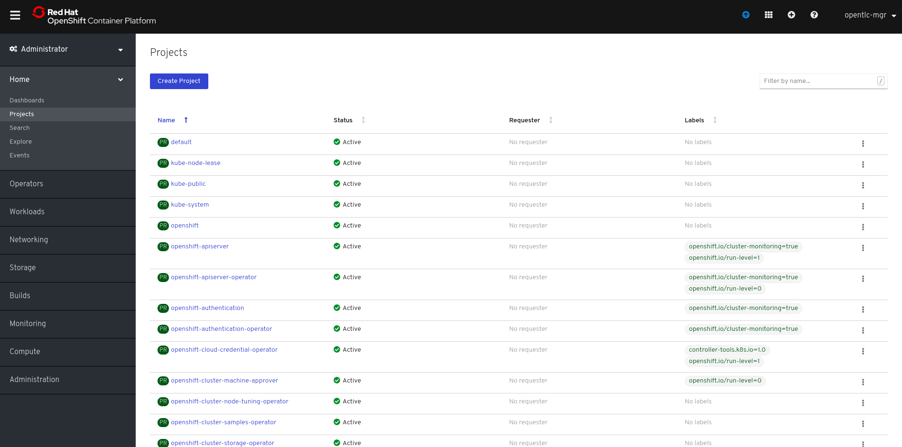
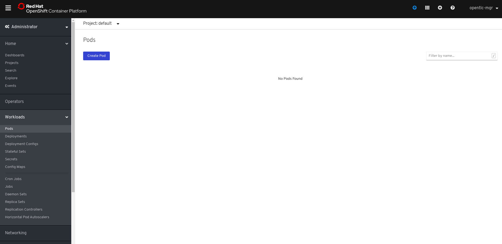

# Uso das interfaces Web Console e 'oc'

**O console web da Plataforma OpenShift Container é uma interface de usuário disponível a partir de um navegador da web.** Os desenvolvedores podem usar o console da web para visualizar, navegar e gerenciar o conteúdo dos projetos.

Da mesma forma, **com a interface da linha de comandos (CLI) do OpenShift, você pode criar aplicativos e gerenciar projetos OpenShift a partir de um terminal.** A CLI é ideal em situações em que você está:

- Trabalhando diretamente com o código fonte do projeto.

- Operações de script do OpenShift.

- Restrito aos recursos de largura de banda e não pode usar o console da web.

A CLI do OpenShift está disponível usando o comando `oc`:

```
$ oc < comando >
(...)
```

Caso você queira instalar na sua máquina local, você pode baixar e descompactar a CLI com uma assinatura ativa do OpenShift Enterprise no Red Hat Customer Portal ou através do link: <https://mirror.openshift.com/pub/openshift-v4/clients/ocp/latest/>

## Pré-requisitos

- Você deve ter acesso a um cluster da Plataforma OpenShift Container.
- Você deve ter o link de acesso ao Console, seja ele local ou providenciado pelo instrutor.
- Você deve ter instalado a CLI.

## Efetuando login no Console

Você pode efetuar login via console para acessar e gerenciar seu cluster.

Acesse o link disponibilizado de Web Console, e insira as credenciais.



Em seguida, você deveria ver o dashboard principal da Openshift Container Platform.



## Efetuando login na CLI

Você também pode efetuar login via CLI para acessar e gerenciar seu cluster.

Efetue login na CLI usando o comando `oc login` e insira as informações necessárias quando solicitado.

```
$ oc login
Server https://seu-link
The server uses a certificate signed by an unknown authority.
You can bypass the certificate check, but any data you send to the server could be intercepted by others.
Use insecure connections? (y/n): y

Authentication required for https://seu-link (openshift)
Username: <<username>>
Password:
Login successful.

You don't have any projects. You can try to create a new project, by running

    oc new-project <projectname>

Welcome! See 'oc help' to get started.
```

De forma alternativa, você pode gerar um token de autenticação através do Web Console, e usá-lo para logar no OpenShift:



Uma tela será aberta requisitando autenticação e em seguida o token será disponibilizado.

Agora você pode criar um projeto ou emitir outros comandos para gerenciar seu cluster.

## Criando um projeto

Use o comando `new-project` para criar um novo projeto.

```
$ oc new-project openshift-demo
Now using project "openshift-demo" on server "https://seu-link".
```

Similarmente, no console, acesse a aba `Home` e selecione `Projects` no sidebar à esquerda e você poderá visualizar e criar novos projetos através do botão em azul `Create Project`.



## Visualizando pods

Use o comando `oc get pods` para visualizar os pods do projeto atual. Caso seu projeto tenha ao menos um pod, a saída será a seguinte:

```
$ oc get pods
NAME                  READY   STATUS      RESTARTS   AGE     IP            NODE                           NOMINATED NODE
<<nome do pod>>       0/1     Completed   0          5m45s   10.131.0.10   <<identificação do node>>      <none>
(...)
```

Similarmente, no console, acesse a aba `Workloads` e selecione `Pods` no sidebar à esquerda e você poderá visualizar e gerenciar os pods do projeto em questão.



## Listando recursos de API suportados

Use o comando `oc api-resources` para visualizar a lista de recursos da API suportados no servidor.

```
$ oc api-resources
NAME                                  SHORTNAMES       APIGROUP                              NAMESPACED   KIND
bindings                                                                                     true         Binding
componentstatuses                     cs                                                     false        ComponentStatus
configmaps                            cm                                                     true         ConfigMap
(...)
```

Pode pode ainda usar o comando `oc explain` para explicação de cada _api-resource_.

```
$ oc explain configmaps
KIND:     ConfigMap
VERSION:  v1

DESCRIPTION:
   ConfigMap holds configuration data for pods to consume.

FIELDS:
(...)
```

## Ajuda

Adicionalmente, você pode obter ajuda com os comandos da CLI e os recursos da OpenShift Container Platform das seguintes maneiras:
Use `oc help` para obter uma lista e descrição de todos os comandos da CLI disponíveis:

```
$ oc help

OpenShift Client

This client helps you develop, build, deploy, and run your applications on any
OpenShift or Kubernetes cluster. It also includes the administrative
commands for managing a cluster under the 'adm' subcommand.

Usage:
  oc [flags]

Basic Commands:
  login           Log in to a server
  new-project     Request a new project

(...)
```

Você ainda pode usar o sinalizador `--help` para obter ajuda sobre um comando específico da CLI:

```
$ oc create --help

Create a resource from a file or from stdin.

 JSON and YAML formats are accepted.

Usage:
  oc create -f FILENAME [flags]
(...)
```

Ou ainda, caso queira explorar mais o web console, bem como configurá-la corretamente, acesse a documentação oficial.
[Web Console - Documentação Oficial Red Hat](https://docs.openshift.com/container-platform/4.2/web-console/web-console.html)

## Desconectando-se da CLI

Você pode desconectar a CLI para encerrar sua sessão atual.
Use o comando `oc logout`.

```
$ oc logout
(...)
```

Isso exclui o token de autenticação salvo do servidor e o remove do seu arquivo de configuração.

Similarmente, você pode deslogar do console na barra de navegação no alto da tela, e selecionar `Log out`.

Veremos com mais detalhes sobre como criar e gerenciar nossas aplicações no capítulo à seguir.
**Pŕoximo:** [Automação de Build](/developer-experience/build-automation)

**Se você quiser saber mais sobre os comandos oc , como Developer CLI commands  e Administrator CLI commands basta acessar o link <https://docs.openshift.com/container-platform/4.2/cli_reference/openshift_cli/getting-started-cli.html> e será direcionado para documentação na qual explica cada um dos comandos disponíveis a serem usados no terminal.**
