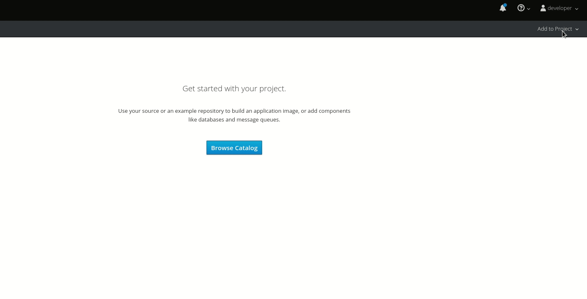
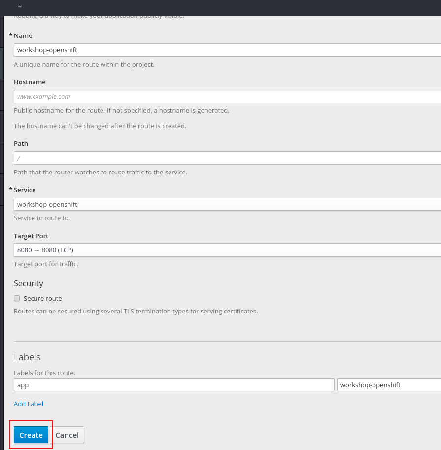
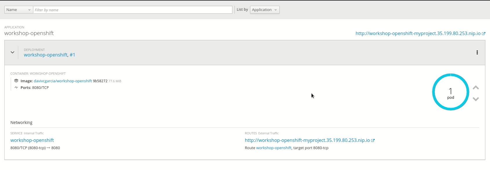
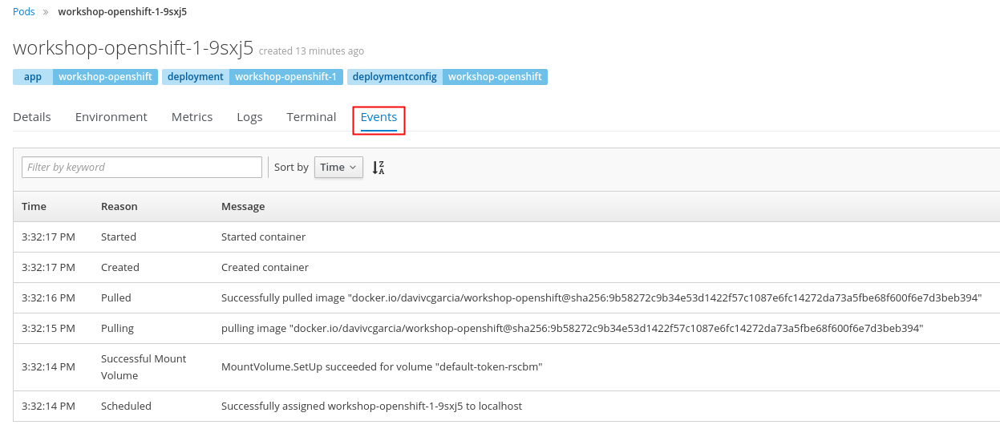

# 2.1.2 - Deploy imagem do Docker Hub

Vamos agora implantar uma imagem existente no Docker Hub. Para executar a imagem. siga os passos abaixo:

**Openshift 3.7**



## Escolha a imagem

Você pode usar a imagem criada durante o lab de introdução ao Docker. Ela ficou salva no seguinte formato

```text
docker.io/<usuario do dockerhub>/workshop-openshift
```

Caso não tenha nenhuma você pode usar essa de exemplo:

[https://hub.docker.com/r/davivcgarcia/workshop-openshift/](https://hub.docker.com/r/davivcgarcia/workshop-openshift/)

Ficando assim o formato:

```text
docker.io/davivcgarcia/workshop-openshift
```

> **OBS: Por questões de segurança a imagem não pode ser executada utilizando o usuário root.**

Se a imagem escolhida rodar como root, o Openshift te avisa na console \(por meio de uma tarja laranja\) que ela pode eventualmente não executar conforme o esperado.


Caso queira usar a linha de comando, execute:

`oc new-app <nome do seu usuario docker.io>/workshop-openshift -n <nome do seu projeto do openshift>`


## Crie a rota para expor a aplicação externamente

Na interface web selecione a opção _**create route.**_


E depois clique em **create**



Depois de criado, a url irá aparece na tela principal


**Command line**

Também podemos usar a linha de comando para criar a nossa rota. Para isso, basta executar:

`oc expose svc workshop-openshift -n <nome do seu projeto do openshift>`


## Explorando a GUI do POD

Para ver detalhes do container que acabamos de criar, basta clicar em cima do circulo azul e depois navegar pelas abas `Details, Environment, Metrics, Logs, Terminal e Events`



**Detalhes do POD**


1. Ip do POD
2. Node no qual o POD está executando
3. Imagem utilizada
4. Porta exposta pelo POD

**Environment**


**Logs do POD**


**Terminal do POD**


**Eventos do POD**



Mais informações:[ ](https://blog.openshift.com/deploying-images-from-dockerhub/)

[https://blog.openshift.com/getting-any-docker-image-running-in-your-own-openshift-cluster/](https://blog.openshift.com/getting-any-docker-image-running-in-your-own-openshift-cluster/)

[https://blog.openshift.com/deploying-images-from-dockerhub/](https://blog.openshift.com/deploying-images-from-dockerhub/)

