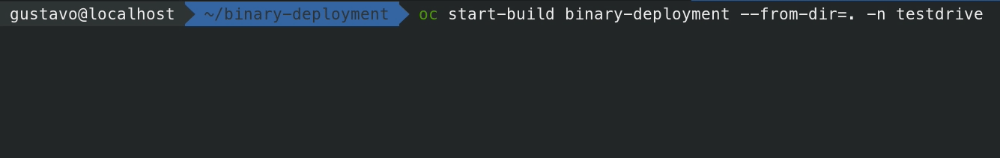
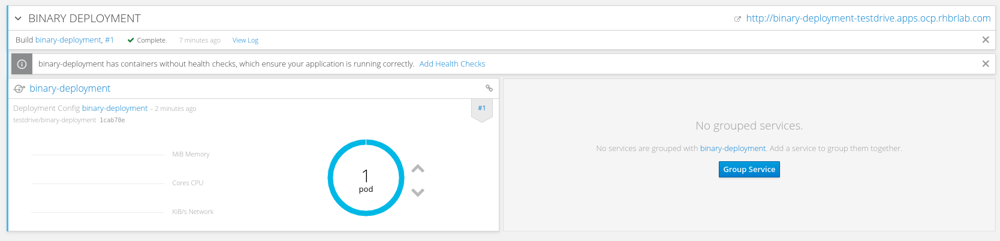

# 2.1.7 - Binary Deployment

O Openshift permite que imagens docker sejam construídas automaticamente, informando somente o repositório do código-fonte por meio do Source-to-Image como você pode testar no Lab 2.1.5. Mas existem casos que você já tem o binário da sua aplicação compilado e pronto em um repositório como o Nexus. O Openshift também possibilita que possamos executar o processo do source-to-image utilizando esse binário.

Iremos criar um JBoss EAP 7 com um aplicação chamada contador.

## Importando a Image Stream do EAP 7

Importe a definição de Image Stream do EAP 7.0:

```text
   oc create -f https://raw.githubusercontent.com/jboss-openshift/application-templates/master/eap/eap70-image-stream.json
```

Crie os Secrest usados pelos temapltes do EAP 7.0

```text
   oc create -f https://raw.githubusercontent.com/jboss-openshift/application-templates/master/secrets/eap7-app-secret.json
```

Verifique se o Image Stream está presente em seu namespace

```text
oc get is | grep eap7
```

## Download da app de exemplo

Vamos criar agora uma pasta para trabahar nessa demonstração:

```text
mkdir -p ~/binary-deployment/deployments && cd ~/binary-deployment
```

Para testar essa funcionalidade, vamos baixar o binário da nossa aplicação de exemplo. Clique [nesse link](https://github.com/luszczynski/contador/blob/master/contador.war?raw=true) para iniciar o download e salve na pasta `~/binary-deployment/deployments`. Ou execute o seguinte comando:

```text
curl -L https://github.com/luszczynski/contador/blob/master/contador.war?raw=true \
 -o ~/binary-deployment/deployments/contador.war
```


## Criando binary deployment no Openshift

Agora precisamos falar para o Openshift criar um novo build usando o JBoss EAP e dizendo para ele para não usar o código-fonte e sim o binário da aplicação.

```bash
oc new-build \
 --image-stream=jboss-eap70-openshift:1.7 \
 --binary=true \
 --name=binary-deployment
```

Esse comando irá criar um BuildConfig que nada mais é que um arquivo descritor explicando como o Openshift deve construir a imagem docker. O detalhe nesse caso é o parametro **--binary=true.** Ele instrui que o BuildConfig use o binário ao invés do código-fonte da aplicação.


Se olharmos os BuildConfig que acabamos de criar, podemos perceber que ele é do tipo binário. Para ver os buildconfigs executamos:

```text
oc get bc
```


Nosso próximo passo é executar o build que acabamos de criar:

```text
oc start-build binary-deployment --from-dir=.
```

Estamos passando nesse comando qual o diretório que queremos enviar para a imagem do JBoss EAP 7. Nesse caso, é o diretório atual. A imagem do JBoss EAP sabe que deve pegar os arquivos que estão dentro da pasta **deployment** e jogar na pasta do JBoss responsável pelo deployment.

Isso tudo acontece porque essa imagem do JBoss usa S2I e portanto sabe o que fazer quando recebe um binário. Você poderia criar uma imagem e adicionar esse comportamento caso desejado.



Após executar o comando acima, um novo build é iniciado. Para visualizar, acesse:

1. No menu lateral, clique em **Builds** -&gt; **Builds**
2. Na tabela seguinte, clique em **binary-deployment**


Assim que o build concluir, ele irá apresentar o status como **completed**


Agora podemos criar nossa aplicação com base na nova imagem gerado por esse build.

Para isso, executamos:

```text
oc new-app binary-deployment
```


Preciamos por último criar uma rota para que nossa aplicação possa ser acessada por fora do Openshift.

```text
oc expose svc binary-deployment
```

No final, sua aplicação estará disponível no cluster da seguinte forma:



