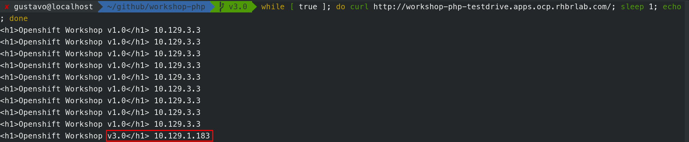

# 2.2.1 Canary Release

Canary release é uma técnica utilizada para reduzir o risco de introduzir uma nova versão de software em ambiente de produção, lançando lentamente a mudança para um pequeno grupo de usuários antes de lançá-lo para toda a infra-estrutura e disponibilizá-lo para todos.


## Preparando nossa aplicação

Vamos lançar uma nova versão da nossa aplicação e aplicar a técnica de Canary Release. Para isso, vamos criar um branch no git contendo nosso código mais novo.

Na raiz do seu repositório git, execute:

```text
git branch v3.0
git checkout v3.0
```


Agora vamos editar o arquivo e alterar a versão da nossa aplicação para 3.0 conforme abaixo:

```text
<?php
echo "<h1>Openshift Workshop v3.0</h1> ";
echo $_SERVER['SERVER_ADDR']
?>
```


Quando finalizado, podemos agora fazer o commit e push para nosso repositório.

```text
git add index.php
git commit -m "v3.0"
git push origin v3.0
```

Se fizemos tudo certo, em nosso Github deve existir um novo branch:


Crie uma nova app usando a versão do Branch 3.0 que acabamos de criar usando o comando `oc`:

```
oc new-app --name=workshop-php-v3 https://github.com/<username>/workshop-openshift.git#v3.0
oc expose svc/workshop-php-v3
```

Quando tudo finalizar, teremos 2 versões da nossa aplicação rodando no Openshift.


Se abrirmos o link da primeira versão temos:


E se abrirmos o link da última versão que criamos:


A URL de acesso da primeira versão é a única que nossos usuários conhecem e portanto é nela que iremos fazer a separação da quantidade de acesso.


Vamos configurar para que a versão 3.0 tenha somente **10%** dos acessos enquanto a versão 1.0 terá **90%.**

* Clique em **Applications** -&gt; **Routes**
* Na tabela, seleciona a rota de nome **workshop-php**
* No menu superior direito clique em **Actions** -&gt; **Edit**
* Selecione o campo **Split traffic across multiple services**
* Arraste a barra para que o fique somente 10% para o **workshop-php-v3**


E altere os valores conforme figura abaixo:


Assim que salvarmos, o Openshift irá mostrar uma tela com as configurações que escolhemos.


E também na tela inicial temos um aviso que o acesso está sendo divido.


## Testando a divisão de acesso na nossa aplicação

Para testarmos que realmente 90% do acesso está indo para versão 1.0 e 10% para v3.0, vamos usar um comando do shell:

```bash
while [ true ]; do curl http://workshop-php-testdrive.apps.ocp.rhbrlab.com/; sleep 1.3; echo; done
```

Esse comando irá executar um curl na sua aplicaçao em cada 1s.

Altere a url acima de acordo com a sua aplicação.

Perceba que a cada 10 requisições para nossa aplicação, 1 é enviada para a versão 3.0.



