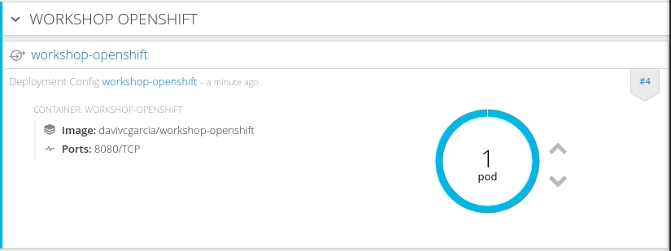
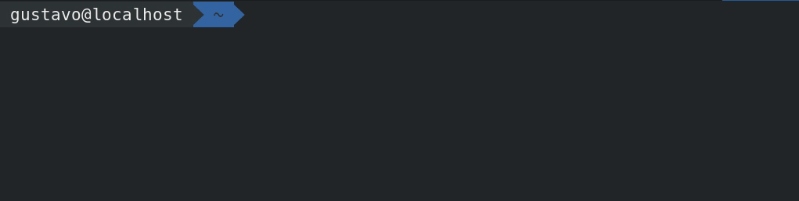

# 2.1.8 - Health Checks

Componentes de software ficam indisponíveis por varias razões, como por exemplo falha de comunicação, erro de configuração ou problemas com dependências externas como banco de dados ou broker de mensagens. O Openshift possui dois recursos bastante poderosos para fazer o health checks de aplicações. O primeiro que iremos abordar é o Liveness e em seguida o Readiness.

## Liveness

O liveness verifica se o container ainda está em execução \(de forma sadia\). Se a verificação falhar este container é morto e sujeitado a política de restart que por padrão é "always". Logo o comportamento padrão é se acontecer alguma falha o container é reiniciado.

O liveness pode ser verificado de 3 possíveis formas:

* Executando um handshake de portas
* Executando alguns dos verbos HTTP \(GET, POST, PUT, DELETE, etc\) em um contexto da aplicação
* Executando um comando ou script dentro do container

## Readiness

O readiness define quando que o container está pronto para receber requisições. Caso a verificação do readiness falhe nenhuma requisição será direcionado para este container até que a verificação seja satisfeita. Os mesmos 3 tipos de testes mencionados no liveness também se aplicam para o readiness.

* Executando um handshake de portas
* Executando alguns dos verbos HTTP \(GET, POST, PUT, DELETE, etc\) em um contexto da aplicação
* Executando um comando ou script dentro do container

## Preparando a aplicação

Para testarmos o liveness e o readiness vamos criar dois novos contextos na nossa aplicação. Segue o conteúdo dos dois arquivos abaixo:

`liveness.php`

```php
<?php
$filename = '/tmp/liveness';

if (file_exists($filename)) {
    header("HTTP/1.1 500 Internal Server Error");
} else {
    echo "Ok";
}
?>
```

e o`readiness.php`

```php
<?php
$filename = '/tmp/readiness';

if (file_exists($filename)) {
    header("HTTP/1.1 500 Internal Server Error");
} else {
    echo "Ok";
}
?>
```

Você pode criar os dois arquivos pela console do github conforme já fizemos em outros labs.

O resultado final do repositório deve estar conforme imagem abaixo:


Os códigos dos dois probes verificam se existe um arquivo no `/tmp` dentro do container. No caso do `liveness.php`ele verifica se existe um arquivo chamado `/tmp/liveness`. Caso exista, ele retorna status 500. O mesmo procedimento é executado também no `readiness.php com a diferença que ele busca o arquivo /tmp/readiness.`

Também podemos atualizar nosso repositório pela linha de comando do git.

```bash
git add .
git commit -m "health check adicionado"
git push
```

## Atualizando nosso container

O Openshift não tem como saber que nosso código foi alterado no repositório github pois não configuramos os `webhooks`. Isso será feito na próxima lição. Enquanto isso, vamos criar um novo build da nossa aplicação de maneira manual.

1. Selecione no menu vertical esquerdo a opção **Builds** -&gt; **Builds**
2. Clique no **workshop-ocp **na tabela apresentada
3. No menu superior direito, clique em **Start Build**


Assim que o build terminar, podemos verificar se aplicação está na sua nova versão. Para isso, basta abrir o contexto `/liveness.php` e `/readiness.php`

Caso esteja tudo certo, você verá um **Ok** na tela.


## Configuração no Openshift

Precisamos agora informar o Openshift para monitorar esses dois contextos novos da aplicação. Precisamos abrir o deployment da aplicação: 


E logo em seguida, edite o health check


Clique em `add liveness` e `add readiness`


Abaixo segue a configuração do readiness


E o liveness


Também podemos configurar o `liveness`e `readiness` por meio da linha de comando.

Antes, veja qual o nome do deploymentconfig usando o comando:

```text
oc get dc
```

Substitua ele no comando abaixo para o `readiness`:

```text
oc set probe dc/workshop-ocp \
 --readiness \
 --get-url=http://:8080/readiness.php
```


Para o `liveness`:

```text
oc set probe dc/workshop-ocp \
 --initial-delay-seconds=20 \
 --liveness \
 --get-url=http://:8080/liveness.php
```


Perceba que adicionamos um delay inicial para o health check do liveness. Fizemos isso para evitar que o Openshift fique matando o container enquanto o mesmo estiver "subindo".

O Openshift informa para nós por meio da console web que a aplicação não está pronta para receber requisição por meio da cor azul clara. Se o circulo ficar azul claro, quer dizer que o seu POD não passou no teste de readiness.



O container ficar azul claro rapidamente e logo em seguida volta a ficar azul escuro. Isso quer dizer que por um breve período de tempo, ele não passou no readiness probe.

## Testando o readiness da nossa aplicação

Para testarmos o readiness, vamos executar um comando que cria um arquivo na pasta tmp.

```text
oc exec <nome do pod> touch /tmp/readiness
```


Na console, agora o container ficará azul claro assim que o Openshift perceber que o readiness probe falhou.

### Debug do container

O Openshift permite que você faça um debug do seu container caso ele não passe no teste de readiness. Para testar essa funcionalidade, basta clicar no container que está com problema e logo em seguida clicar em "Debug in Terminal".

Essa opção `Debug in Terminal` é condicional. Ela só aparece na Web Console quando o seu container está com problema.


## Testando o liveness da nossa aplicação

O mesmo passo executado no passo anterior pode ser feito para o liveness.

```text
oc exec <nome do pod> touch /tmp/liveness
```



Assim que o Openshift perceber que o container parou de responder no contexto do /liveness.php, ele vai matar e criar outro container \(que não terá esse arquivo /tmp/liveness já que ele não existe na imagem\).

### Mais informações

[https://docs.openshift.com/container-platform/3.6/dev\_guide/application\_health.html](https://docs.openshift.com/container-platform/3.6/dev_guide/application_health.html)

